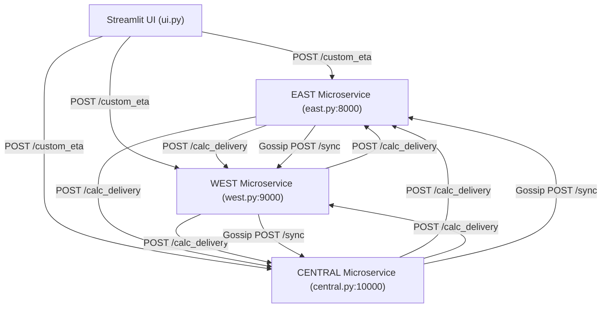

# EdgeSync Research Dossier: Architecture Deep Dive

**Target Conference:** IEEE PerCom 2027  
**Document ID:** `01_ARCHITECTURE_DEEP_DIVE.md`

---

## 1. System Layers Analysis

The architecture of EdgeSync is analyzed below by comparing the **Paper Claims** (from `EdgeSyncETA_Final.doc`) against the **Actual Source Code Implementation**.



### Layer Status Matrix

| System Layer | Status in Code | Code Evidence / Details | Paper Claim vs Code Discrepancy |
| :--- | :--- | :--- | :--- |
| **Client Layer** | **ACTUAL IMPLEMENTATION** | Streamlit app in [`ui.py`](file:///d:/Desktop/NM-Notes%20anf%20Files/EdgeSync_Research%20Paper/Project_Files/EdgeSync-ETA-main/EdgeSync-ETA-main/ui.py). Folium map for point selection. | Paper describes interactive frontend. Matches code. |
| **Cloud Coordination Layer** | **NOT IMPLEMENTED** | Streamlit UI imports `get_region` directly ([`ui.py:L9`](file:///d:/Desktop/NM-Notes%20anf%20Files/EdgeSync_Research%20Paper/Project_Files/EdgeSync-ETA-main/EdgeSync-ETA-main/ui.py#L9)) and routes directly to local microservice ports (`http://localhost:8000/custom_eta`). | Paper claims a standalone "lightweight cloud coordinating layer... acts as entry point... stateless routing". No such cloud service exists in code. |
| **Edge Layer / Regional Services** | **ACTUAL IMPLEMENTATION** | 3 FastAPI instances ([`east.py`](file:///d:/Desktop/NM-Notes%20anf%20Files/EdgeSync_Research%20Paper/Project_Files/EdgeSync-ETA-main/EdgeSync-ETA-main/east.py), [`west.py`](file:///d:/Desktop/NM-Notes%20anf%20Files/EdgeSync_Research%20Paper/Project_Files/EdgeSync-ETA-main/EdgeSync-ETA-main/west.py), [`central.py`](file:///d:/Desktop/NM-Notes%20anf%20Files/EdgeSync_Research%20Paper/Project_Files/EdgeSync-ETA-main/EdgeSync-ETA-main/central.py)) running on ports 8000, 9000, 10000. | Paper claims independent cluster microservices. Matches code. |
| **Communication Layer** | **ACTUAL IMPLEMENTATION** | Synchronous REST HTTP POST requests via Python `requests` library ([`east.py:L52-L56`](file:///d:/Desktop/NM-Notes%20anf%20Files/EdgeSync_Research%20Paper/Project_Files/EdgeSync-ETA-main/EdgeSync-ETA-main/east.py#L52-L56)). | Matches implementation. |
| **Synchronization Layer** | **ACTUAL IMPLEMENTATION** | Background daemon thread running `gossip()` in each microservice ([`east.py:L98-L111`](file:///d:/Desktop/NM-Notes%20anf%20Files/EdgeSync_Research%20Paper/Project_Files/EdgeSync-ETA-main/EdgeSync-ETA-main/east.py#L98-L111)). | Gossip protocol exists, but synchronization formulas exhibit unhandled sample inflation (see Section 5). |
| **Storage / State Layer** | **PARTIAL IMPLEMENTATION** | Volatile in-memory dictionary `state = {"avg_eta": 0, "samples": 0}` and list `logs = []`. | Paper implies dynamic state persistence. In reality, no database or persistent file storage is used (**`NOT IMPLEMENTED`**). |

---

## 2. Regional Microservice Architecture

Each region operates as a standalone FastAPI web application process.

### Detailed Region Comparison Table

| Attribute | EAST Node | WEST Node | CENTRAL Node |
| :--- | :--- | :--- | :--- |
| **Source File** | [`east.py`](file:///d:/Desktop/NM-Notes%20anf%20Files/EdgeSync_Research%20Paper/Project_Files/EdgeSync-ETA-main/EdgeSync-ETA-main/east.py) | [`west.py`](file:///d:/Desktop/NM-Notes%20anf%20Files/EdgeSync_Research%20Paper/Project_Files/EdgeSync-ETA-main/EdgeSync-ETA-main/west.py) | [`central.py`](file:///d:/Desktop/NM-Notes%20anf%20Files/EdgeSync_Research%20Paper/Project_Files/EdgeSync-ETA-main/EdgeSync-ETA-main/central.py) |
| **HTTP Port** | `8000` | `9000` | `10000` |
| **Spatial Boundary** | Lat ≥ 19.05°N, Lon ≥ 72.85°E | Lat ≥ 19.05°N, Lon < 72.85°E | Lat < 19.05°N |
| **Primary APIs** | `/custom_eta`, `/calc_delivery`, `/sync`, `/logs` | `/custom_eta`, `/calc_delivery`, `/sync`, `/logs` | `/custom_eta`, `/calc_delivery`, `/sync`, `/logs` |
| **Local State** | `avg_eta`, `samples`, `logs` | `avg_eta`, `samples`, `logs` | `avg_eta`, `samples`, `logs` |
| **Gossip Outbound Peer** | `WEST` (`http://localhost:9000/sync`) | `CENTRAL` (`http://localhost:10000/sync`) | `EAST` (`http://localhost:8000/sync`) |
| **Gossip Frequency** | 5.0 seconds | 5.0 seconds | 5.0 seconds |

---

## 3. End-to-End Request Lifecycle

### Intra-Region Delivery Flow (Source Region == Destination Region)

```text
User Action (Selects Src & Dst in EAST)
  │
  ▼
[ui.py:L104] config.get_region(src_lat, src_lon) ➔ Returns "EAST"
  │
  ▼
[ui.py:L123-L129] requests.post("http://localhost:8000/custom_eta", json={...})
  │
  ▼
[east.py:L19] custom_eta(data: dict)
  ├─► [east.py:L27] get_region(dest[0], dest[1]) ➔ Returns "EAST"
  ├─► [east.py:L30] pickup = get_rider_distance_from_option(rider) * 2
  ├─► [east.py:L31] prep = get_prep_time(food)
  ├─► [east.py:L41] dest_region == region ("EAST" == "EAST")
  │     └─► delivery = estimate_time_from_distance(distance(src, dst), traffic)
  ├─► [east.py:L60] ETA = max(pickup, prep) + delivery
  ├─► [east.py:L63-L66] Update state:
  │     state["samples"] += 1
  │     state["avg_eta"] = ((state["avg_eta"] * (samples - 1)) + ETA) / samples
  └─► Return JSON response {"ETA": ..., "pickup": ..., "prep": ..., "delivery": ..., "traffic": ...}
  │
  ▼
[ui.py:L141-L167] Render ETA metric cards & Matplotlib bar chart
```

### Code Evidence for Intra-Region Calculation
```text
File: east.py
function/class: custom_eta()
purpose: Intra-region delivery execution
relevant behavior: When dest_region == region, delivery time is calculated locally using estimate_time_from_distance(distance(source, dest), traffic_level).
```

---

## 4. Cross-Region Request Lifecycle

When the delivery source is in one region (e.g. `EAST`) and the destination is in another region (e.g. `WEST`):

```text
User Action (Src: Powai [EAST], Dst: Bandra [WEST])
  │
  ▼
[ui.py:L104] src_region = get_region(src) ➔ "EAST"; dst_region = get_region(dst) ➔ "WEST"
  │
  ▼
[ui.py:L123] POST http://localhost:8000/custom_eta
  │
  ▼
[east.py:L19] custom_eta() invoked on EAST node
  ├─► Pickup & Prep calculated locally on EAST node
  ├─► dest_region ("WEST") != region ("EAST")
  ├─► [east.py:L52-L56] HTTP POST call initiated to peer node:
  │     requests.post("http://localhost:9000/calc_delivery", json={
  │         "source": source,
  │         "dest": dest,
  │         "traffic": traffic_level
  │     })
  │       │
  │       ▼ (Network Hop across Microservices)
  │     [west.py:78] calc_delivery(data) on WEST node
  │       ├─► delivery = estimate_time_from_distance(distance(source, dest), traffic_level)
  │       └─► Return {"delivery_time": delivery}
  │       │
  │       ▲ (Response returned to EAST node)
  ├─► delivery = res["delivery_time"]
  ├─► ETA = max(pickup, prep) + delivery
  └─► Return final ETA breakdown JSON to ui.py
```

### Code Evidence for Cross-Region Inter-Service Call
```text
File: east.py / west.py / central.py
function/class: custom_eta() lines 46-58
purpose: Forwarding destination leg distance computation to remote edge node.
relevant behavior: Uses url_map dictionary to issue HTTP POST requests to destination region's /calc_delivery endpoint.
```

---

## 5. System Data Structures & Control Flow

### Primary Data Structures

1. **State Dictionary (`state`):**
   ```python
   # Maintained globally in memory per microservice process (east.py:L13-L16)
   state = {
       "avg_eta": 0,    # Running average ETA in minutes (float)
       "samples": 0     # Total sample count (int)
   }
   ```

2. **Log Buffer (`logs`):**
   ```python
   # List of strings tracking gossip activities (east.py:L11)
   logs = []  # e.g., ["EAST → Sent avg 25.40", "EAST ← Received avg 22.10"]
   ```

3. **Coordinates & Points:**
   - Coordinates passed as 2-element tuples: `(latitude, longitude)`.

---

## 6. Architecture Vulnerabilities Identified

1. **Unprotected Remote HTTP Calls:** Cross-region delegation ([`east.py:L52`](file:///d:/Desktop/NM-Notes%20anf%20Files/EdgeSync_Research%20Paper/Project_Files/EdgeSync-ETA-main/EdgeSync-ETA-main/east.py#L52)) has **no `try-except` block** and **no HTTP timeout set**. If the destination node crashes or experiences network latency, the source node's `/custom_eta` blocks indefinitely or raises an unhandled HTTP exception (`ConnectionError`), causing UI failure.
2. **Missing Local State Lock:** `state` dictionary updates occur concurrently in the FastAPI endpoint thread and the background gossip daemon thread without thread safety locks (`threading.Lock`), exposing the system to race conditions during high concurrent traffic.
