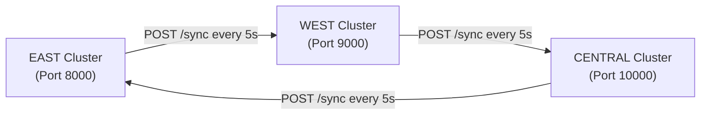

# EdgeSync Research Dossier: Gossip Protocol Analysis

**Target Conference:** IEEE PerCom 2027  
**Document ID:** `04_GOSSIP_PROTOCOL_ANALYSIS.md`

---

## 1. Gossip Ring Topology

EdgeSync implements a **static 3-node unidirectional ring topology** connecting the regional edge clusters:

$$\text{EAST (8000)} \longrightarrow \text{WEST (9000)} \longrightarrow \text{CENTRAL (10000)} \longrightarrow \text{EAST (8000)}$$



### Source Code Evidence:
```text
File: east.py
function/class: gossip()
line numbers: Lines 98-111
relevant behavior: Sends POST request with local state to http://localhost:9000/sync every 5 seconds.
```

```text
File: west.py
function/class: gossip()
line numbers: Lines 98-111
relevant behavior: Sends POST request with local state to http://localhost:10000/sync every 5 seconds.
```

```text
File: central.py
function/class: gossip()
line numbers: Lines 98-111
relevant behavior: Sends POST request with local state to http://localhost:8000/sync every 5 seconds.
```

---

## 2. Message Format & Protocol Specifications

- **Protocol:** HTTP/1.1 REST POST
- **Sync Frequency:** Fixed tick interval of **5.0 seconds** (`time.sleep(5)`).
- **Execution Threading:** Spawns a background Python thread marked as `daemon=True` ([`east.py:L111`](file:///d:/Desktop/NM-Notes%20anf%20Files/EdgeSync_Research%20Paper/Project_Files/EdgeSync-ETA-main/EdgeSync-ETA-main/east.py#L111)).
- **Payload Schema (JSON):**
  ```json
  {
    "avg_eta": 28.45,
    "samples": 14
  }
  ```

---

## 3. Merge Algorithm & Mathematical Formulation

When a node receives a `/sync` HTTP POST payload containing $A_{\text{incoming}}$ (`avg_eta`) and $N_{\text{incoming}}$ (`samples`), it merges the data into its local state ($A_{\text{local}}, N_{\text{local}}$):

$$N_{\text{total}} = N_{\text{local}} + N_{\text{incoming}}$$

$$A_{\text{new}} = \frac{(A_{\text{local}} \times N_{\text{local}}) + (A_{\text{incoming}} \times N_{\text{incoming}})}{N_{\text{total}}}$$

$$N_{\text{new}} = N_{\text{total}}$$

```text
File: east.py / west.py / central.py
function/class: sync(data: dict)
line range: Lines 114-132
```

---

## 4. Deep Analysis of Protocol Vulnerabilities & Mathematical Flaws

### Vulnerability 1: Sample Count Inflation (Lack of Idempotency)

> [!WARNING]
> **CRITICAL DISTRIBUTED SYSTEMS BUG:**  
> Section V of `EdgeSyncETA_Final.doc` explicitly claims:  
> *"It is also idempotent with respect to repeated merges of the same state, preventing double-counting."*  
>  
> **This claim is mathematically FALSE in the current implementation.**

#### Analysis:
Consider two nodes (EAST and WEST) with initial states:
- EAST state: $A_E = 20.0, N_E = 10$
- WEST state: $A_W = 30.0, N_W = 10$

1. **Tick 1 (EAST sends to WEST):**
   - WEST receives $(A_E=20, N_E=10)$.
   - WEST total samples: $N_W' = 10 + 10 = 20$.
   - WEST new average: $A_W' = \frac{(30 \times 10) + (20 \times 10)}{20} = 25.0$.
2. **Tick 2 (5 seconds later, no new orders processed):**
   - EAST sends unchanged state $(A_E=20, N_E=10)$ to WEST again.
   - WEST total samples: $N_W'' = 20 + 10 = 30$.
   - WEST new average: $A_W'' = \frac{(25 \times 20) + (20 \times 10)}{30} = 23.33$.
3. **Tick 100 (after 500 seconds, zero new user orders):**
   - WEST sample count inflates to $N_W = 1010$.
   - WEST average $A_W$ converges unnaturally to $A_E = 20.0$, wiping out WEST's own original historical average!

**Root Cause:** The code treats periodic gossip sync messages as **new independent order samples** rather than maintaining version vectors, timestamps, or unique sample identifiers.

---

### Vulnerability 2: Memory Leak in Log Buffer
In `east.py:L103, L106, L130`, every gossip send and receive appends a string to the global in-memory list `logs`. Over a 24-hour deployment:
- Gossip ticks: $\frac{86400}{5} = 17,280$ ticks per day per node.
- Memory consumption of `logs` list grows infinitely without bound (even though `/logs` only returns `logs[-10:]`).

---

## 5. Consistency & Fault Tolerance Analysis

### Consistency Model: **Best-Effort Asynchronous Synchronization**
- The system does **not** provide strong consistency or valid eventual consistency due to the sample inflation bug.
- Without sample inflation fixes (e.g., using Vector Clocks or CRDTs), the network averages drift dynamically based on ring rotation speeds rather than true sample distributions.

### Failure Scenario Matrix

| Failure Scenario | Implemented Code Behavior | Resulting System State |
| :--- | :--- | :--- |
| **1 Peer Node Down (e.g. WEST offline)** | EAST `gossip()` catches `requests.exceptions` in `try-except` ([`east.py:L105`](file:///d:/Desktop/NM-Notes%20anf%20Files/EdgeSync_Research%20Paper/Project_Files/EdgeSync-ETA-main/EdgeSync-ETA-main/east.py#L105)), logs `"EAST → Gossip failed"`. | EAST service stays alive for local ETA requests. Gossip ring broken at WEST. |
| **Cross-Region Delivery during Node Down** | `/custom_eta` on EAST node attempts `POST http://localhost:9000/calc_delivery` **without try-except**. | **Unhandled Exception (`ConnectionError`)**. Client request crashes with 500 internal server error. |
| **Node Restart** | Memory reset (`state = {"avg_eta": 0, "samples": 0}`). | Rejoining node starts with 0 samples, then absorbs inflated sample counts from peers upon first sync. |
| **Network Partition** | Nodes operate in isolated partition. | State diverges; sample counts inflate locally upon reconnection. |

---

## 6. Theoretical Communication Complexity

- **Message Complexity:** $\mathcal{O}(1)$ messages per node per tick interval $\Delta t = 5\text{s}$.
- **Network Overhead:** $1$ HTTP POST payload ($\sim 150\text{ bytes}$) per node every 5 seconds. Total cluster traffic $= 3 \times 150\text{ B} = 450\text{ bytes/5s} = 90\text{ bytes/sec}$.
