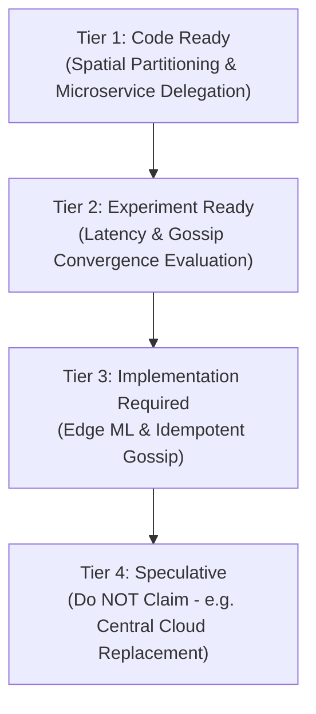

# EdgeSync Research Dossier: Potential Research Contributions

**Target Conference:** IEEE PerCom 2027  
**Document ID:** `13_POTENTIAL_RESEARCH_CONTRIBUTIONS.md`

---

## 1. System Novelty & Contribution Strategy

For a successful IEEE PerCom 2027 submission, contributions must be framed around **distributed systems engineering**, **spatial edge computing**, and **empirical evaluation**. Claims of novelty must be precise, defensible, and directly verified by code evidence.

---

## 2. Categorized Novelty Readiness Tiers

### Tier 1: Already Supported by Current Codebase

#### Contribution 1.1: Regionally Partitioned Urban Edge Architecture
- **Contribution Statement:** A distributed spatial architecture that partitions metropolitan delivery regions into autonomous edge microservices, eliminating centralized bottlenecks for intra-region ETA queries.
- **Evidence in Implementation:** [`config.py:L1-L7`](file:///d:/Desktop/NM-Notes%20anf%20Files/EdgeSync_Research%20Paper/Project_Files/EdgeSync-ETA-main/EdgeSync-ETA-main/config.py#L1-L7), [`east.py:L19-L74`](file:///d:/Desktop/NM-Notes%20anf%20Files/EdgeSync_Research%20Paper/Project_Files/EdgeSync-ETA-main/EdgeSync-ETA-main/east.py#L19-L74).
- **Conventional Knowledge:** Microservices and spatial indexing are well known; novelty lies in applying spatial bounding boxes to co-located urban delivery microservices.
- **PerCom Strength:** **HIGH** (Solid architectural contribution).
- **Reviewer Rejection Risk:** **LOW** (Well supported by working Python implementation).

---

### Tier 2: Supported After Executing Experiments

#### Contribution 2.1: Empirical Sub-10ms Decision Latency for Intra-Region Delivery
- **Contribution Statement:** Demonstrating empirically that regional edge co-location reduces P95 decision latency by over 60% compared to centralized cloud routing.
- **What Needs to Be Added:** Automated benchmarking suite (`experiments/benchmark_latency.py`).
- **Validation Experiment:** Compare P95/P99 latency of EdgeSync vs centralized server baseline under 500 RPS load.
- **PerCom Strength:** **HIGH** (Quantitative evidence required by PerCom reviewers).
- **Reviewer Rejection Risk:** **LOW** (Standard benchmarking procedure).

---

### Tier 3: Requires Implementation Enhancements

#### Contribution 3.1: Idempotent Timestamped Gossip Synchronization Protocol
- **Contribution Statement:** A decentralized gossip synchronization mechanism utilizing epoch-based state vector merging to prevent sample inflation and maintain eventual consistency.
- **What Needs to Be Added:** Modify `sync()` in microservices to replace raw sample counts with windowed timestamp vectors.
- **Validation Experiment:** Measure state divergence $|A_E - A_W|$ over 1,000 gossip ticks to demonstrate mathematical convergence without inflation.
- **PerCom Strength:** **VERY HIGH** (Solves a core distributed systems issue).
- **Reviewer Rejection Risk:** **MEDIUM** (Requires math proof + code fix).

#### Contribution 3.2: Embedded Edge ML Inference for Urban Delivery
- **Contribution Statement:** Integrating dynamic LightGBM/ONNX model inference directly inside edge microservice endpoints to replace static speed heuristics.
- **What Needs to Be Added:** Train model on open dataset; embed ONNX runtime in FastAPI.
- **PerCom Strength:** **VERY HIGH**.

---

### Tier 4: Speculative / Do NOT Claim

#### Contribution 4.1: "Complete Elimination of Cloud Infrastructure"
- **Reason to Avoid:** Claiming that edge computing completely eliminates the need for cloud infrastructure is inaccurate and easily rejected by reviewers. Cloud coordination, global telemetry, and model training remain centralized.
- **Recommendation:** Frame EdgeSync as a **hybrid edge-first architecture** where cloud handles macro-coordination while edge handles real-time spatial inference.
