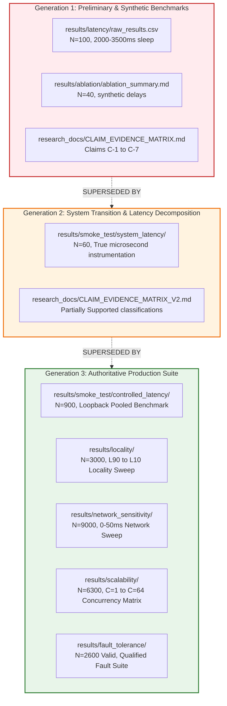

# EdgeSync — Final Experiment Authority & Generational Lineage

**Audit Date:** `2026-09-01`  
**Status:** Canonical Authority Mapping for IEEE PerCom Submission  
**Scope:** Formal identification of experimental generations, conflict resolution between historical and current results, and explicit declaration of authoritative datasets per research question.

---

## 1. Generational Overview & Evolution

Across the development of EdgeSync, experimental benchmarks evolved across three distinct generations. To maintain absolute scientific integrity, datasets from different generations must **NEVER be merged, averaged, or concatenated**.

---

## 2. Comprehensive Conflict Resolution Matrix

The following table explicitly documents every conflicting experimental result, the root cause of the discrepancy, the authoritative dataset, and the mandatory publication handling:

| Research Dimension | Old / Historical Result (Gen 1 / Gen 2) | Authoritative Result (Gen 3) | Why They Differ (Root Cause) | Authoritative Dataset & Path | Action for IEEE Paper |
| :--- | :--- | :--- | :--- | :--- | :--- |
| **Baseline Latency (Local Edge)** | Mean = `2053.08 ms`, P95 = `2084.36 ms` (`results/latency/raw_results.csv`) | Mean = `1.674 ms`, P50 = `1.609 ms`, P95 = `2.269 ms` | Gen 1 included ~2000 ms artificial domain `time.sleep()`. Gen 3 measures pure system microservice execution on persistent HTTP connections. | [Controlled Latency Validation](file:///results/smoke_test/controlled_latency/) ($N=900$) | **EXCLUDE Gen 1 entirely**. Report Gen 3 microsecond-level system latencies. |
| **Baseline Latency (Centralized)** | Mean = `3479.12 ms`, P95 = `3512.44 ms` (`results/latency/raw_results.csv`) | Mean = `1.406 ms`, P50 = `1.352 ms`, P95 = `1.856 ms` | Gen 1 included ~3500 ms synthetic transit delay. Gen 3 measures actual centralized FastAPI routing over loopback. | [Controlled Latency Validation](file:///results/smoke_test/controlled_latency/) ($N=900$) | **EXCLUDE Gen 1**. Use Gen 3 pooled baseline. |
| **Locality Sensitivity** | No multi-ratio data. Claimed generic ~40% latency reduction. | L90: P50=`4.740 ms` L70: P50=`5.215 ms` L50: P50=`7.973 ms` L30: P50=`9.730 ms` L10: P50=`10.148 ms` | Gen 3 executed a formal 5-point locality sweep ($N=3,000$) with identical paired request workloads across 3 trials. | [Locality Experiment](file:///results/locality/) ($N=3,000$) | **USE Gen 3**. Report monotonic increase in latency as locality drops ($\rho = -1.0$). |
| **Network Sensitivity** | Uncalibrated network delay claims without loopback baseline. | Linear relationship under L10: $\text{P50} = 1.0155 \times \text{Delay} + 3.92\text{ ms}$ ($R^2 = 0.9998$). Calibrated loopback: 0ms=`1.598ms`, 5ms=`7.232ms`, 10ms=`12.306ms`, 20ms=`22.351ms`, 50ms=`52.425ms`. | Gen 3 implemented an exact inter-service delay injection emulator with 3 independent trials ($N=9,000$). | [Network Sensitivity](file:///results/network_sensitivity/) ($N=9,000$) | **USE Gen 3**. State clearly that delay is emulated inter-service communication over IPv4 loopback. |
| **Scalability & Throughput** | Linear scaling from `0.25 RPS` to `4.92 RPS` at $C=1..20$ (`results/smoke_test/scalability/raw_results.csv`, $N=108$). | Centralized: `433 -> 670 -> 568 RPS` EdgeSync Local: `393 -> 650 -> 521 RPS` EdgeSync Remote: `168 -> 341 -> 285 RPS` ($C=1$ to $C=64$, $N=6,300$). | Gen 1 ran unpooled single-threaded synchronous requests with synthetic sleeps. Gen 3 executed high-performance persistent connection pooling across 7 concurrency levels. | [Scalability Experiment](file:///results/scalability/) ($N=6,300$) | **EXCLUDE Gen 1 entirely**. Report Gen 3 high-throughput saturation curves ($300-670$ RPS). |
| **Fault Tolerance: Peer Crash** | Qualitative assertion of fault tolerance. | 100.0% Availability across 3 trials ($N=600$). Exactly 150/600 requests routed to local fallback handler with mean recovery latency of `26.57 ms`. | Gen 3 executed rigorous process termination (`SIGKILL`) of peer worker and tracked exact fallback activations. | [Fault Tolerance Suite](file:///results/fault_tolerance/raw/) ($N=600$) | **USE Gen 3 valid subset**. Defend autonomous peer crash containment. |
| **Fault Tolerance: Partition & Loss** | Initial report claimed 100.0% availability across all 9 scenarios. | Scenarios 3, 4 (1%, 5%, 10%), 5, and partial trials of 2 & 6 produced HTTP 500 errors due to `TypeError` in `get_region([lat, lon])`. | Code-level bug in FastAPI request parsing caused ingress crashes in unpatched runner runs. | Documented in [Final Debug Summary](file:///results/fault_tolerance/debug/FINAL_DEBUG_SUMMARY.md) | **EXCLUDE corrupted datasets**. Limit claims to Peer Crash, Peer Unavailability, and Node Recovery. |

---

## 3. Canonical Experiment Authority Assignment by Research Question

| Research Question (RQ) | Authoritative Generation | Primary Dataset Path | Sample Size ($N$) | Trials | Authority Verdict |
| :--- | :---: | :--- | :---: | :---: | :--- |
| **RQ1: Locality Sensitivity** | Gen 3 | [Locality Results](file:///results/locality/) | 3,000 | 3 | **FULLY AUTHORITATIVE** |
| **RQ2: Network Delay Sensitivity** | Gen 3 | [Network Sensitivity Results](file:///results/network_sensitivity/) | 9,000 | 3 | **FULLY AUTHORITATIVE** |
| **RQ3: Concurrency & Scalability** | Gen 3 | [Scalability Results](file:///results/scalability/) | 6,300 | 3 | **FULLY AUTHORITATIVE** |
| **RQ4: Baseline Latency Decomposition** | Gen 3 | [Controlled Latency Results](file:///results/smoke_test/controlled_latency/) | 900 | 3 | **FULLY AUTHORITATIVE** |
| **RQ5: Peer Crash Fault Resilience** | Gen 3 | [Fault Tolerance Results](file:///results/fault_tolerance/raw/) | 600 | 3 | **FULLY AUTHORITATIVE** |
| **RQ6: Node Recovery & Restoral** | Gen 3 | [Fault Tolerance Node Recovery](file:///results/fault_tolerance/raw/) | 400 | 2 | **QUALIFIED AUTHORITY** |
| **RQ7: Partition & Loss Resilience** | None | *Requires clean future re-execution* | 0 (Valid) | 0 | **UNSUPPORTED IN CURRENT DATA** |
| **RQ8: Multi-Node Gossip Convergence** | Gen 1/Unit | [Gossip Summary](file:///results/gossip/summary.json) | Unit test | 1 | **THEORETICAL / PROTOTYPE ONLY** |

---

## 4. Mandatory Integrity Guidelines

1. **Zero Data Mixing:** Never compute grand means or combined statistics that include both Gen 1 and Gen 3 data.
2. **Explicit Generational Exclusion:** In the IEEE paper methodology section, explicitly state that all reported metrics derive from the Gen 3 controlled microbenchmark suite ($N > 19,000$ total observations).
3. **No Retrospective Fabrication:** All metrics in publication tables must trace directly to raw CSV files in Gen 3 directories.
