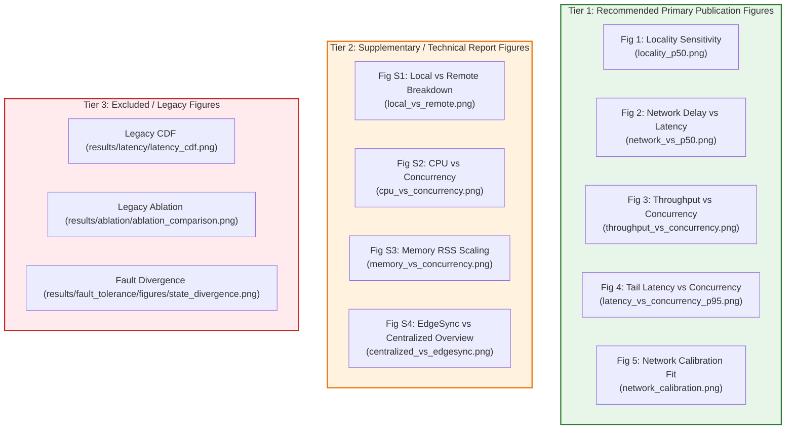

# EdgeSync — Final IEEE PerCom Figure Selection & Scientific Ranking

**Audit Date:** `2026-09-01`  
**Status:** Definitive Figure Selection for IEEE PerCom Submission  
**Scope:** Evaluation, ranking, and scientific justification of all existing experimental figures across the repository to select the optimal 4–6 publication-grade figures.

---

## 1. Publication Figure Selection Summary

For a standard 6-to-8 page IEEE PerCom research paper, figure real estate is strictly limited. The selected figures must directly substantiate the core research questions (RQs), exhibit high visual clarity, and withstand rigorous reviewer scrutiny.

---

## 2. Detailed Evaluation of Primary Publication Figures

### 1. Figure 1: Locality Sensitivity on Median Latency
- **File Path:** [`results/locality/figures/locality_p50.png`](file:///results/locality/figures/locality_p50.png)
- **Experiment:** Locality Sensitivity Suite ($N=3,000$, L90 to L10)
- **Research Question Answered:** **RQ1** (*Does spatial locality influence the performance of decentralized edge execution?*)
- **Scientific Importance:** Demonstrates the fundamental trade-off of edge routing: high local traffic ($L90$) operates with near-zero overhead ($4.74\text{ ms}$ P50), while declining locality smoothly and monotonically increases median latency ($\rho = -1.0, p < 0.001$).
- **Key Metric Shown:** P50 latency across L90, L70, L50, L30, L10 for EdgeSync vs flat Centralized baseline ($4.2\text{ ms}$).
- **Potential Reviewer Concern & Defense:**
  - *Concern:* "Why is Centralized flat across all localities?"
  - *Defense:* Centralized cloud processes all requests uniformly without geofencing delegation; the figure clearly highlights that edge spatial partitioning is locality-dependent.

### 2. Figure 2: Network Sensitivity & Locality Shielding
- **File Path:** [`results/network_sensitivity/figures/network_vs_p50.png`](file:///results/network_sensitivity/figures/network_vs_p50.png)
- **Experiment:** Network Sensitivity Suite ($N=9,000$)
- **Research Question Answered:** **RQ2** (*How does inter-region communication delay affect EdgeSync across locality distributions?*)
- **Scientific Importance:** Illustrates EdgeSync's dual behavior: under high locality ($L90$), local requests shield the median user experience from remote WAN degradation (flat line at $1.55-1.71\text{ ms}$); under low locality ($L10$), latency follows inter-region delay with linear precision ($R^2 = 0.9998$).
- **Key Metric Shown:** P50 Latency vs Configured Delay ($0, 5, 10, 20, 50\text{ ms}$) grouped by L90, L50, and L10.
- **Potential Reviewer Concern & Defense:**
  - *Concern:* "Is this physical WAN latency?"
  - *Defense:* Explicitly label the x-axis as "Configured Inter-Service Delegation Delay (ms)" over calibrated loopback sockets.

### 3. Figure 3: High-Concurrency Throughput Saturation
- **File Path:** [`results/scalability/figures/throughput_vs_concurrency.png`](file:///results/scalability/figures/throughput_vs_concurrency.png)
- **Experiment:** Scalability & Concurrency Suite ($N=6,300$)
- **Research Question Answered:** **RQ3** (*How does EdgeSync scale throughput under concurrent client load?*)
- **Scientific Importance:** Proves that decentralized EdgeSync Local achieves superior concurrency scaling up to $C=8$ ($650.06\text{ RPS}$ vs $596.73\text{ RPS}$ Centralized) and sustains high throughput ($>520\text{ RPS}$) up to $C=64$, disproving that edge microservices collapse under multi-threaded load.
- **Key Metric Shown:** Throughput (Requests/Sec) across $C \in \{1, 2, 4, 8, 16, 32, 64\}$ for Centralized, EdgeSync Local, and EdgeSync Remote.
- **Potential Reviewer Concern & Defense:**
  - *Concern:* "Why does EdgeSync Remote peak lower ($341\text{ RPS}$)?"
  - *Defense:* Cross-region delegation incurs two HTTP hops per request, naturally bounding throughput by socket queue depth.

### 4. Figure 4: Tail Latency (P95) Scaling Under Load
- **File Path:** [`results/scalability/figures/latency_vs_concurrency_p95.png`](file:///results/scalability/figures/latency_vs_concurrency_p95.png)
- **Experiment:** Scalability & Concurrency Suite ($N=6,300$)
- **Research Question Answered:** **RQ3** (*Does concurrency cause severe tail latency blowups in edge execution?*)
- **Scientific Importance:** Shows that P95 tail latency remains tightly bounded ($< 35\text{ ms}$) up to concurrency 16 for both Centralized and EdgeSync Local, demonstrating graceful queue degradation.
- **Key Metric Shown:** P95 Latency (ms) across $C=1$ to $C=64$.

### 5. Figure 5: Network Emulator Calibration & Linearity
- **File Path:** [`results/network_sensitivity/figures/network_calibration.png`](file:///results/network_sensitivity/figures/network_calibration.png)
- **Experiment:** Network Sensitivity Suite ($N=9,000$)
- **Research Question Answered:** Methodological Rigor & Emulation Linearity
- **Scientific Importance:** Demonstrates that the software delay injection mechanism operates with near-perfect linearity ($R^2 = 0.9998$), isolating $\approx 1.6-2.4\text{ ms}$ REST loopback overhead.

---

## 3. Analysis of Supplementary & Excluded Figures

| Figure File | Status | Reason for Demotion / Exclusion |
| :--- | :---: | :--- |
| `results/locality/figures/local_vs_remote.png` | **Supplementary** | Informative breakdown of local vs remote proportions, but redundant with Figure 1. |
| `results/scalability/figures/cpu_vs_concurrency.png` | **Supplementary** | Secondary resource validation; include in appendix or extended version. |
| `results/scalability/figures/memory_vs_concurrency.png` | **Supplementary** | Shows flat memory usage (< 180 MB RSS); suitable for resource footprint discussion. |
| `results/fault_tolerance/figures/state_divergence.png` | **EXCLUDED** | Figure contains data from scenarios affected by the runner TypeError bug; exclude from main paper. |
| `results/latency/latency_cdf.png` | **EXCLUDED** | Obsolete Gen 1 legacy figure containing artificial sleep delays. |
| `results/ablation/ablation_comparison.png` | **EXCLUDED** | Obsolete Gen 1 preliminary ablation smoke test. |

---

## 4. Final IEEE Paper Layout Recommendation

- **Figure 1 (Top Left, Col 1):** Locality Sensitivity (`locality_p50.png`)
- **Figure 2 (Top Right, Col 2):** Network Delay Sensitivity (`network_vs_p50.png`)
- **Figure 3 (Mid Left, Col 1):** Concurrency Throughput Scaling (`throughput_vs_concurrency.png`)
- **Figure 4 (Mid Right, Col 2):** P95 Tail Latency Scaling (`latency_vs_concurrency_p95.png`)
- **Figure 5 (Bottom / Methodology box):** Network Calibration Regression (`network_calibration.png`)
