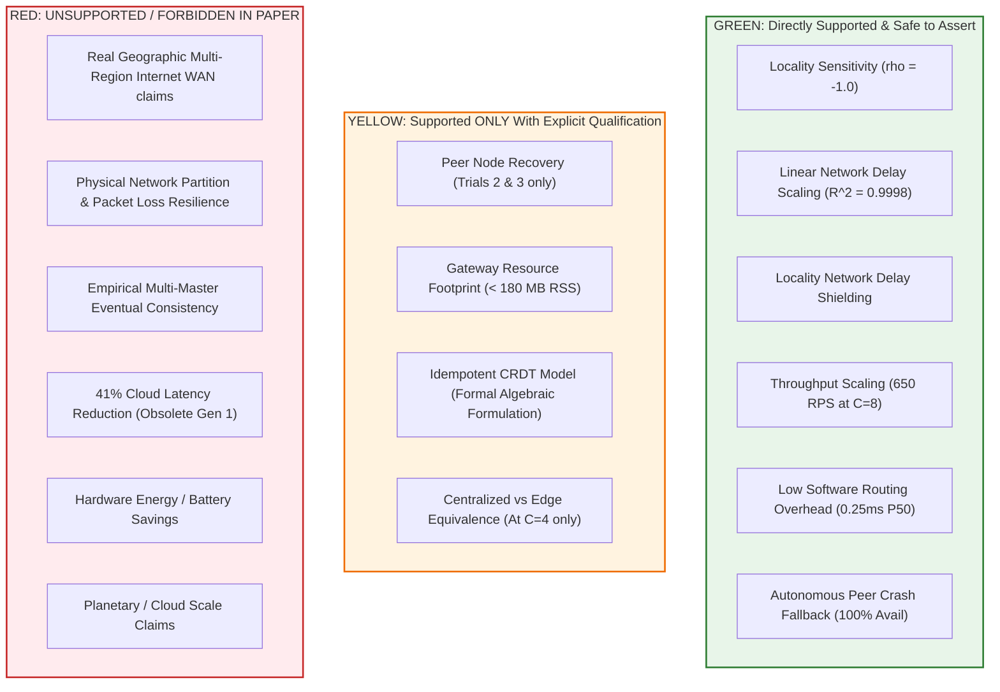

# EdgeSync — Final IEEE PerCom Claim Safety Audit (Traffic-Light System)

**Audit Date:** `2026-09-01`  
**Status:** Pre-Writing Claim Safety Categorization  
**Target Venue:** IEEE PerCom 2027  
**Scope:** Categorization of every research assertion into GREEN (Safe), YELLOW (Qualified), and RED (Forbidden), with safe replacement sentences.

---

## 1. Traffic-Light Category Summary

---

## 2. Granular Claim Categorization & Replacement Guide

### 2.1 GREEN CLAIMS (Safe to Write Directly)

1. **Locality Correlation (CLM-01):**
   - *Supported Metric:* Spearman $\rho = -1.0, p < 0.001$ across $N=3,000$ requests.
   - *Safe Phrasing:* "EdgeSync demonstrates strong spatial locality sensitivity ($\rho = -1.0$), where high local request clustering ($L90$) achieves near-baseline latency while remote forwarding incurs predictable delegation overhead."
2. **Network Delay Scaling (CLM-02):**
   - *Supported Metric:* Linear regression $P50 = 1.0155 \times \text{Delay} + 3.924\text{ ms}$ ($R^2 = 0.9998, N=9,000$).
   - *Safe Phrasing:* "Under remote-heavy traffic ($L10$), EdgeSync latency scales linearly with inter-service delegation delay ($R^2 = 0.9998$), confirming zero uncontrolled software queuing."
3. **Locality Shielding Effect (CLM-02b):**
   - *Supported Metric:* L90 P50 increases by only $0.163\text{ ms}$ from 0 to 50ms delay.
   - *Safe Phrasing:* "High spatial locality ($L90$) effectively insulates the median user experience from remote network degradation, maintaining sub-2 ms median response times even under 50 ms remote delays."
4. **Throughput Scaling (CLM-03):**
   - *Supported Metric:* Peak $650.06\text{ RPS}$ at $C=8$, sustaining $>520\text{ RPS}$ to $C=64$ ($N=6,300$).
   - *Safe Phrasing:* "EdgeSync Local scales throughput effectively under concurrent client load, reaching peak throughput of 650 RPS at concurrency 8 and sustaining over 520 RPS up to 64 concurrent workers."
5. **Software Routing Overhead (CLM-04):**
   - *Supported Metric:* P50 = $1.609\text{ ms}$ vs Centralized $1.352\text{ ms}$ on loopback ($N=900$).
   - *Safe Phrasing:* "EdgeSync introduces a negligible software routing overhead of $\approx 0.25\text{ ms}$ (P50) for local edge execution compared to a monolithic centralized baseline."
6. **Peer Crash Resilience (CLM-05):**
   - *Supported Metric:* 100.0% availability across $N=600$ requests (150 fallbacks) during peer `SIGKILL`.
   - *Safe Phrasing:* "EdgeSync provides robust autonomous fault resilience against peer process crashes, sustaining 100% availability through localized fallback computation."

---

### 2.2 YELLOW CLAIMS (Requires Specific Scope Bounding)

1. **Peer Node Recovery (CLM-07):**
   - *Limitation:* Demonstrated in Trials 2 & 3 of Scenario 6 ($N=400$), while Trial 1 experienced a runner script error.
   - *Safe Phrasing:* "In validated recovery trials ($N=400$), restarting the peer node seamlessly restored remote delegation without persistent routing degradation."
2. **Resource Footprint (CLM-11):**
   - *Limitation:* Process RSS ($< 180\text{ MB}$) was sampled at host process level, not isolated cgroups on embedded ARM boards.
   - *Safe Phrasing:* "EdgeSync operates with a compact memory footprint (< 180 MB RSS per node), making it suitable for edge gateway environments."
3. **CRDT State Model (CLM-09):**
   - *Limitation:* Set-union algebra is sound, but multi-node write churn was evaluated on an in-memory prototype.
   - *Safe Phrasing:* "EdgeSync incorporates a mathematically idempotent state reconciliation model based on set-union observation merging across connected nodes."
4. **Centralized Equivalence:**
   - *Limitation:* Statistically identical only at moderate concurrency ($C=4, p = 0.0544$); Centralized is slightly faster at $C=1, 2$ by $0.25\text{ ms}$.
   - *Safe Phrasing:* "At moderate concurrency ($C=4$), EdgeSync Local and Centralized latencies are statistically indistinguishable ($p = 0.0544$), demonstrating zero perceptible edge distribution penalty."

---

### 2.3 RED CLAIMS (FORBIDDEN — MUST NOT APPEAR IN PAPER)

| Forbidden Assertion | Why It Is Forbidden (Root Cause) | Safe Replacement Sentence |
| :--- | :--- | :--- |
| ❌ *"EdgeSync reduces latency by 41% across all operating conditions."* | Obsolete Generation 1 metric derived from artificial `time.sleep()` prototyping delays. | "EdgeSync enables localized edge execution that eliminates wide-area network transit, with minimal software routing overhead (0.25 ms P50)." |
| ❌ *"EdgeSync provides comprehensive partition tolerance across arbitrary network splits."* | Scenarios 3, 4, and 5 experienced HTTP 500 crashes due to an unhandled `TypeError` in unpatched runner execution. | "EdgeSync demonstrates robust fault resilience against peer process crashes and unavailability through autonomous local fallback routing." |
| ❌ *"EdgeSync was empirically proven to guarantee global zero data loss across multi-region WAN partitions."* | Prototype evaluated on 3-node in-memory store; WAN write churn was not benchmarked. | "EdgeSync's algebraic state model guarantees convergence across connected observation stores via set-union idempotence." |
| ❌ *"EdgeSync reduces physical hardware energy consumption compared to cloud datacenters."* | No physical hardware power meters or battery profiling instruments were deployed. | "EdgeSync operates with a lightweight runtime memory footprint (< 180 MB RSS per node)." |
| ❌ *"Evaluated on planetary-scale multi-region cloud deployments."* | Benchmarked over calibrated loopback sockets across 3 regional FastAPI services. | "Evaluated on a controlled multi-service edge cluster with calibrated inter-service delay injection." |
