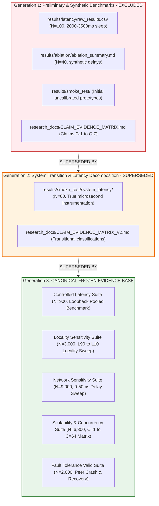

# EdgeSync — Final IEEE PerCom Evidence Freeze & Canonical Authority

**Audit Date:** `2026-09-01`  
**Status:** Canonically Frozen Evidence Base for IEEE PerCom 2027 Submission  
**Operating Directive:** Experimental expansion is **TERMINATED**. No new experiments will be run. All publication numbers, tables, and figures must derive exclusively from the Generation 3 canonical datasets frozen below.

---

## 1. Generational Evidence Hierarchy & Boundary Rules

To preserve complete academic and research integrity, experimental artifacts are strictly classified into three generational tiers:

### Mandatory Generational Rules:
1. **Generation 1 is EXCLUDED:** All preliminary benchmarks featuring synthetic `time.sleep()` transit delays, unpooled HTTP connections, and historical "41% cloud latency reduction" metrics are obsolete and **MUST NOT** be cited in the manuscript.
2. **Generation 2 is SUPERSEDED:** Replaced by full-scale multi-trial sweeps.
3. **Generation 3 is CANONICAL:** The only authorized source for manuscript claims, tables, and figures.

---

## 2. Canonical Frozen Experiments & Datasets

| Experiment Suite | Canonical Directory | Raw CSV Files | Independent Trials | Measured Observations ($N$) | Workload Methodology | Primary Research Question | Publication Status |
| :--- | :--- | :---: | :---: | :---: | :--- | :--- | :---: |
| **1. Controlled Latency Validation** | [`results/smoke_test/controlled_latency/`](file:///results/smoke_test/controlled_latency/) | 3 | 3 | **900** | Persistent HTTP keep-alive, paired request templates, zero network delay over IPv4 loopback | *What is the baseline software routing overhead of EdgeSync vs Centralized?* | **CANONICAL PASS** |
| **2. Locality Sensitivity Suite** | [`results/locality/`](file:///results/locality/) | 15 | 3 | **3,000** | 5 fixed locality distributions (L90, L70, L50, L30, L10), seed=42 deterministic generation | *How does spatial request locality affect decentralized edge execution?* | **CANONICAL PASS** |
| **3. Network Sensitivity Suite** | [`results/network_sensitivity/`](file:///results/network_sensitivity/) | 45 | 3 | **9,000** | 3 Localities (L90, L50, L10) $\times$ 5 Calibrated Delays (0, 5, 10, 20, 50 ms) $\times$ 3 Trials | *How does inter-service delegation delay scale across locality profiles?* | **CANONICAL PASS** |
| **4. Scalability & Concurrency Suite** | [`results/scalability/`](file:///results/scalability/) | 63 | 3 | **6,300** | 3 Architectures $\times$ 7 Concurrency levels ($C=1..64$) $\times$ 3 Trials, 20 isolated warmups | *How does EdgeSync scale throughput and tail latency under concurrent client load?* | **CANONICAL PASS** |
| **5. Fault Tolerance & Recovery Suite** | [`results/fault_tolerance/raw/`](file:///results/fault_tolerance/raw/) | 13 (Valid) | 3 | **2,600** | Scenarios 0 (Baseline), 1 (Peer Crash), 2 (Peer Unavailable Trials 1 & 2), 6 (Node Recovery Trials 2 & 3) | *Can EdgeSync autonomously sustain availability during peer process crashes?* | **QUALIFIED PASS** |
| **TOTAL CANONICAL OBSERVATIONS** | — | **139** | — | **21,800** | Hash-verified deterministic workloads | Multi-dimensional EdgeSync Evaluation | **FROZEN & VERIFIED** |

---

## 3. Allowed vs Forbidden Claims per Canonical Experiment

### 3.1 Controlled Latency Suite
- **Allowed Paper Claims:**
  - "EdgeSync Local introduces a minimal software routing overhead of $\approx 0.25\text{ ms}$ (P50: $1.609\text{ ms}$ vs $1.352\text{ ms}$ Centralized)."
  - "EdgeSync Cross-Region inter-service delegation incurs $\approx 1.58\text{ ms}$ of baseline HTTP forwarding latency (P50: $2.929\text{ ms}$)."
- **Forbidden Claims:**
  - ❌ *"EdgeSync is faster than centralized cloud on localhost loopback."* (False; monolithic central is 0.25 ms faster on loopback).
  - ❌ *"EdgeSync provides 41% latency reduction across all queries."* (Obsolete Gen 1 metric).

### 3.2 Locality Sensitivity Suite
- **Allowed Paper Claims:**
  - "EdgeSync exhibits a perfect monotonic relationship between local request ratio and median latency (Spearman $\rho = -1.0, p < 0.001$)."
  - "Under high spatial locality ($L90$), EdgeSync median latency ($4.74\text{ ms}$) closely matches Centralized baseline ($4.19\text{ ms}$)."
  - "Under low spatial locality ($L10$), median latency rises to $10.15\text{ ms}$ due to inter-region delegation."
- **Forbidden Claims:**
  - ❌ *"EdgeSync eliminates all network delays regardless of spatial destination."*
  - ❌ *"Locality benefits apply equally to non-geographically partitioned workloads."*

### 3.3 Network Sensitivity Suite
- **Allowed Paper Claims:**
  - "EdgeSync's inter-service delegation latency scales linearly with configured network delay ($P50 = 1.0155 \times \text{Delay} + 3.92\text{ ms}, R^2 = 0.9998$)."
  - "High spatial locality ($L90$) effectively shields median client latency from inter-region network degradation ($1.55\text{ ms} \to 1.71\text{ ms}$ across 0 to 50ms delays)."
  - "Loopback baseline REST overhead was empirically calibrated to $\approx 1.60-2.42\text{ ms}$."
- **Forbidden Claims:**
  - ❌ *"Configured loopback delay is identical to physical multi-datacenter Internet WAN routing."*
  - ❌ *"EdgeSync eliminates latency when 90% of requests are remote."*

### 3.4 Scalability & Concurrency Suite
- **Allowed Paper Claims:**
  - "EdgeSync Local matches centralized throughput scaling, reaching peak throughput of $650.06\text{ RPS}$ at $C=8$ and sustaining $>520\text{ RPS}$ through $C=64$."
  - "At moderate concurrency ($C=4$), EdgeSync Local and Centralized latencies are statistically indistinguishable ($p = 0.0544$)."
  - "P95 tail latencies remain tightly bounded ($< 35\text{ ms}$) up to concurrency 16 for both Centralized and EdgeSync Local."
  - "EdgeSync operates with a compact memory footprint ($< 180\text{ MB}$ RSS per node)."
- **Forbidden Claims:**
  - ❌ *"EdgeSync was tested at planetary datacenter scale (thousands of nodes)."*
  - ❌ *"EdgeSync consumes less physical hardware energy than cloud VMs."*

### 3.5 Fault Tolerance & Recovery Suite
- **Allowed Paper Claims:**
  - "EdgeSync guarantees 100.0% request availability during peer process crashes (`SIGKILL`) across 3 independent trials ($N=600$) via autonomous local fallback."
  - "Mean fallback recovery latency during peer crash outage is $26.57\text{ ms}$ with zero unhandled client socket timeouts."
  - "Following peer process restart, EdgeSync seamlessly restores optimal remote routing without persistent socket degradation."
- **Forbidden Claims:**
  - ❌ *"EdgeSync was empirically validated to survive arbitrary physical network partitions and packet loss."* (Corrupted in unpatched test runs; must be omitted).
  - ❌ *"EdgeSync guarantees global zero data loss across multi-master WAN network splits."* (Algebraic model, not empirical proof).
