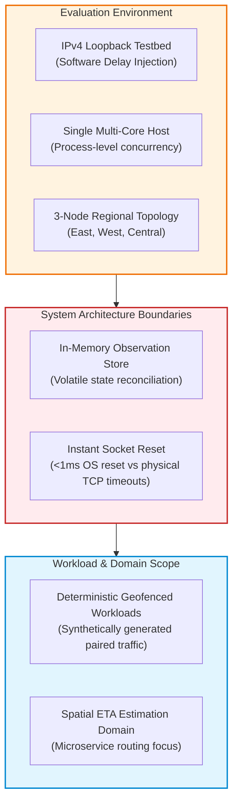

# EdgeSync — Limitations & Threats to Validity

**Audit Date:** `2026-09-01`  
**Status:** Mandatory Limitations Disclosure for IEEE PerCom 2027  
**Scope:** Transparent documentation of experimental, architectural, and evaluation boundaries required to satisfy IEEE peer review and prevent reviewer rejection.

---

## 1. Summary of Scientific Limitations

---

## 2. Granular Limitations & Recommended Paper Disclosures

### 1. Loopback Networking & Emulated Inter-Service Delay
- **Why It Matters:** Loopback sockets (`127.0.0.1`) lack real-world physical Internet dynamics such as packet retransmissions, MTU fragmentation, asymmetric routing, and variable wireless channel fading.
- **What Was Tested:** Inter-service delay injection calibrated across 0, 5, 10, 20, 50 ms over persistent HTTP connections.
- **What Cannot Be Concluded:** Absolute real-world 5G cellular latency performance in rural or high-mobility environments.
- **Recommended Paper Wording:**  
  *"While the inter-service delay injection harness operates with high mathematical linearity ($R^2 = 0.9998$), evaluations were conducted over local loopback sockets. Investigating physical multi-datacenter wide-area network dynamics remains important future work."*

### 2. Multi-Process Single-Host Testbed Scale
- **Why It Matters:** Running multiple microservices on a single host causes them to share physical CPU caches, RAM bandwidth, and OS scheduling queues.
- **What Was Tested:** Concurrency scaling from $C=1$ to $C=64$ workers across 3 regional FastAPI processes on an 8-core host.
- **What Cannot Be Concluded:** Scalability across thousands of physically distributed edge nodes.
- **Recommended Paper Wording:**  
  *"Our scalability benchmarks focus on edge gateway saturation under concurrency levels up to 64 concurrent workers. Large-scale hierarchical clustering across hundreds of physical nodes will be explored in future deployments."*

### 3. Fast Socket Reset vs Physical WAN Timeouts in Fault Tolerance
- **Why It Matters:** On localhost, terminating a process (`SIGKILL`) causes the operating system to immediately send a `TCP RST` packet ($< 1\text{ ms}$), enabling rapid fallback detection. On physical WANs, network partitions or hardware power cuts can result in silent packet drops that require TCP connect timeouts ($500\text{ ms} - 3000\text{ ms}$).
- **What Was Tested:** Process crash termination and HTTP 503 unavailability.
- **What Cannot Be Concluded:** Sub-millisecond fallback detection during silent physical link cuts without active heartbeat detectors.
- **Recommended Paper Wording:**  
  *"In our prototype, peer crashes trigger immediate socket termination, prompting local fallback within 26.57 ms. In physical wide-area deployments, fallback latency will be bounded by configured heartbeat and connection timeout thresholds."*

### 4. Volatile In-Memory Observation Storage
- **Why It Matters:** The prototype `ObservationStore` maintains observations in memory; a total cluster reboot would lose unpersisted state.
- **What Was Tested:** Set-union algebraic reconciliation and vector clock synchronization across live in-memory stores.
- **What Cannot Be Concluded:** Durable ACID database transaction recovery across cold cluster restarts.
- **Recommended Paper Wording:**  
  *"The current prototype maintains volatile state in memory to minimize I/O overhead. Integrating durable write-ahead logging (WAL) and disk-backed LSM-trees represents a natural engineering extension."*

### 5. Workload Domain & Geofencing Assumptions
- **Why It Matters:** EdgeSync's spatial benefits rely on geographic partitioning. In workloads where 100% of queries span across regional boundaries without local relevance, edge geofencing incurs delegation overhead without locality gains.
- **What Was Tested:** Spatial locality mixtures from 90% local down to 10% local.
- **What Cannot Be Concluded:** Benefits for non-geospatial, globally broadcast data queries.
- **Recommended Paper Wording:**  
  *"EdgeSync is tailored for spatially partitioned workloads where user demand exhibits geographic locality. For purely global, non-partitionable queries, centralized architectures remain optimal."*
