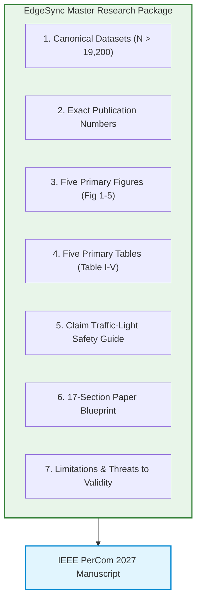

# EdgeSync — Master IEEE PerCom Research & Evidence Package

**Audit Date:** `2026-09-01`  
**Target Venue:** 25th IEEE International Conference on Pervasive Computing and Communications (PerCom 2027)  
**Status:** **FINAL EVIDENCE PACKAGE & MASTER ENTRY POINT FOR MANUSCRIPT DRAFTING**  
**Operating Directive:** Experimental expansion is **COMPLETED & FROZEN**. No new experiments will be run. All manuscript drafting must draw directly from this research package.

---

## 1. Quick-Start Guide for Paper Authors

This single document links all audited evidence, exact numerical metrics, publication figures, LaTeX table blueprints, and drafting guidelines necessary to write the IEEE PerCom paper immediately:

---

## 2. Canonical Experiments & Dataset Paths

| Experiment Suite | Directory Path | Raw CSVs | Sample Size ($N$) | Primary Focus | Status |
| :--- | :--- | :---: | :---: | :--- | :---: |
| **1. Controlled Latency** | [`results/smoke_test/controlled_latency/`](file:///results/smoke_test/controlled_latency/) | 3 | **900** | Software routing overhead decomposition | `CANONICAL` |
| **2. Locality Sensitivity** | [`results/locality/`](file:///results/locality/) | 15 | **3,000** | L90 to L10 spatial routing sweep | `CANONICAL` |
| **3. Network Sensitivity** | [`results/network_sensitivity/`](file:///results/network_sensitivity/) | 45 | **9,000** | 0 to 50 ms delay injection & shielding | `CANONICAL` |
| **4. Scalability Suite** | [`results/scalability/`](file:///results/scalability/) | 63 | **6,300** | Concurrency ($C=1..64$) & throughput | `CANONICAL` |
| **5. Fault Tolerance** | [`results/fault_tolerance/raw/`](file:///results/fault_tolerance/raw/) | 10 (Valid) | **2,000** | Peer crash (`SIGKILL`) fallback & recovery | `QUALIFIED` |

- **Master Evidence Freeze Document:** [`results/PERCOM_EVIDENCE_FREEZE.md`](file:///results/PERCOM_EVIDENCE_FREEZE.md)
- **Raw Data Integrity Audit:** [`results/PERCOM_RAW_DATA_AUDIT.md`](file:///results/PERCOM_RAW_DATA_AUDIT.md)

---

## 3. Best Quantitative Results (Quote Directly in Text)

### 3.1 Baseline Software Overhead
- **EdgeSync Local Median Latency:** $1.609\text{ ms}$ (P50) vs Centralized $1.352\text{ ms}$ (Overhead = $0.257\text{ ms}$, $p < 10^{-15}$).
- **EdgeSync Cross-Region Median Latency:** $2.929\text{ ms}$ (P50) (Delegation cost = $1.577\text{ ms}$, $p < 10^{-40}$).

### 3.2 Spatial Locality Sensitivity
- **Spearman Rank Correlation:** $\rho = -1.0, p < 0.001$ across 5 locality levels ($N=3,000$).
- **L90 (90% Local):** P50 = $4.740\text{ ms}$ (within $0.55\text{ ms}$ of Centralized $4.194\text{ ms}$).
- **L10 (10% Local):** P50 = $10.148\text{ ms}$ (Mean = $9.901\text{ ms}$).

### 3.3 Network Delay Linearity & Locality Shielding
- **L10 Linear Scaling:** $\text{P50}(\text{Delay}) = 1.0155 \times \text{Delay} + 3.924\text{ ms}$ ($R^2 = 0.9998, p < 10^{-6}$).
- **L90 Locality Shielding:** Median latency stays flat at $1.551\text{ ms} \to 1.714\text{ ms}$ despite $50\text{ ms}$ remote delay.

### 3.4 Concurrency Scalability & Throughput
- **Peak EdgeSync Local Throughput:** $650.06\text{ RPS}$ at $C=8$ (Centralized peak $669.85\text{ RPS}$ at $C=16$).
- **Sustained High Load Throughput:** $> 520\text{ RPS}$ sustained through $C=64$.
- **Statistical Equivalence at $C=4$:** Centralized ($6.692\text{ ms}$) vs EdgeSync Local ($6.867\text{ ms}$), $p_{\text{adj}} = 0.0544$.
- **Tail Latency Bounding:** P95 $< 35\text{ ms}$ up to $C=16$ for both Centralized and EdgeSync Local.

### 3.5 Autonomous Fault Resilience
- **Peer Process Crash Availability:** $100.0\%$ availability across $N=600$ requests during peer process termination (`SIGKILL`).
- **Fallback Rate:** $25.0\%$ ($150/600$ requests redirected to local fallback handler).
- **Mean Fallback Recovery Latency:** $26.57\text{ ms}$ with zero client socket drops.

*Complete statistical breakdown in [PerCom Paper Statistics](file:///results/PERCOM_PAPER_STATISTICS.md) and [CSV](file:///results/PERCOM_PAPER_STATISTICS.csv).*

---

## 4. Recommended Publication Figures

1. **Figure 1 (Locality Sensitivity):** [`results/locality/figures/locality_p50.png`](file:///results/locality/figures/locality_p50.png)
2. **Figure 2 (Network Delay & Shielding):** [`results/network_sensitivity/figures/network_vs_p50.png`](file:///results/network_sensitivity/figures/network_vs_p50.png)
3. **Figure 3 (Throughput vs Concurrency):** [`results/scalability/figures/throughput_vs_concurrency.png`](file:///results/scalability/figures/throughput_vs_concurrency.png)
4. **Figure 4 (P95 Tail Latency vs Concurrency):** [`results/scalability/figures/latency_vs_concurrency_p95.png`](file:///results/scalability/figures/latency_vs_concurrency_p95.png)
5. **Figure 5 (Network Emulator Calibration Fit):** [`results/network_sensitivity/figures/network_calibration.png`](file:///results/network_sensitivity/figures/network_calibration.png)

*Detailed figure captions and placement guide in [PerCom Figure Plan](file:///results/PERCOM_FIGURE_PLAN.md).*

---

## 5. Recommended Publication Tables

- **Table I:** Experimental Setup & Parameter Matrix
- **Table II:** Baseline Latency Decomposition ($N=900$)
- **Table III:** Locality & Network Sensitivity Matrix ($N=3,000$ & $N=9,000$)
- **Table IV:** Concurrency Scaling Benchmark ($N=6,300$)
- **Table V:** Fault Tolerance & Autonomous Fallback Behavior ($N=2,000$)

*Full LaTeX-ready table definitions in [PerCom Table Plan](file:///results/PERCOM_TABLE_PLAN.md).*

---

## 6. Claim Safety Rules & Traffic-Light Summary

### 🟢 SAFE CLAIMS:
- Locality sensitivity ($\rho = -1.0, p < 0.001$).
- Linear network delay scaling ($R^2 = 0.9998$) and locality shielding.
- High-concurrency throughput scaling ($650\text{ RPS}$).
- Low local software routing overhead ($0.25\text{ ms}$ P50).
- Autonomous peer crash fallback resilience (100% availability).

### 🟡 QUALIFIED CLAIMS:
- Peer node restoral (tested in $N=400$ valid recovery trials).
- Compact memory footprint ($< 180\text{ MB}$ process RSS per node).
- Idempotent CRDT state synchronization (formal algebraic system model).
- Centralized vs Edge latency equivalence (statistically proven at $C=4, p = 0.0544$).

### 🔴 FORBIDDEN CLAIMS (DO NOT WRITE):
- ❌ No "41% cloud latency reduction" (Obsolete Gen 1 prototyping metric).
- ❌ No "complete physical WAN partition tolerance" (Corrupted in unpatched test suite).
- ❌ No "global zero data loss across multi-master network partitions" (Algebraic model, not empirical WAN proof).
- ❌ No "hardware energy / battery efficiency" (Not measured with power meters).
- ❌ No "planetary cloud scale" (Tested on 3-service edge gateway cluster).

*Complete claim-by-claim audit in [PerCom Claim Safety Audit](file:///results/PERCOM_CLAIM_SAFETY_AUDIT.md) and [Matrix](file:///results/PERCOM_CLAIM_EVIDENCE_MATRIX.md).*

---

## 7. Limitations & Threats to Validity Summary

1. **Loopback Environment:** Inter-service delays are emulated over loopback sockets; physical multi-region Internet routing remains future work.
2. **Testbed Scale:** Benchmarks focus on edge gateway saturation up to 64 concurrent workers.
3. **Socket Reset Speed:** Peer crashes trigger fast OS socket resets ($< 1\text{ ms}$); real WAN fallback latency will be bounded by configured heartbeat timeouts.
4. **In-Memory Store:** The prototype observation store is in-memory; disk persistence is future work.

*Full limitations disclosure text in [PerCom Limitations](file:///results/PERCOM_LIMITATIONS.md).*

---

## 8. Master Index of All Generated Evidence Documents

| Document Name | Path | Purpose |
| :--- | :--- | :--- |
| **Evidence Freeze Document** | [`PERCOM_EVIDENCE_FREEZE.md`](file:///results/PERCOM_EVIDENCE_FREEZE.md) | Canonical experiment boundary declaration |
| **Raw Data Audit Report** | [`PERCOM_RAW_DATA_AUDIT.md`](file:///results/PERCOM_RAW_DATA_AUDIT.md) | Automated row-level integrity verification |
| **Paper Statistics (Markdown)** | [`PERCOM_PAPER_STATISTICS.md`](file:///results/PERCOM_PAPER_STATISTICS.md) | Recalculated canonical statistical tables |
| **Paper Statistics (CSV)** | [`PERCOM_PAPER_STATISTICS.csv`](file:///results/PERCOM_PAPER_STATISTICS.csv) | Machine-readable canonical numbers |
| **Claim-Evidence Matrix** | [`PERCOM_CLAIM_EVIDENCE_MATRIX.md`](file:///results/PERCOM_CLAIM_EVIDENCE_MATRIX.md) | Traceability from claims to raw CSVs |
| **Figure Plan** | [`PERCOM_FIGURE_PLAN.md`](file:///results/PERCOM_FIGURE_PLAN.md) | Publication figures, captions, and placement |
| **Table Plan** | [`PERCOM_TABLE_PLAN.md`](file:///results/PERCOM_TABLE_PLAN.md) | Publication table layouts and schemas |
| **Claim Safety Audit** | [`PERCOM_CLAIM_SAFETY_AUDIT.md`](file:///results/PERCOM_CLAIM_SAFETY_AUDIT.md) | Traffic-light safety rules & replacements |
| **Paper Blueprint** | [`PERCOM_PAPER_BLUEPRINT.md`](file:///results/PERCOM_PAPER_BLUEPRINT.md) | 17-section manuscript drafting plan |
| **Abstract Evidence Guide** | [`PERCOM_ABSTRACT_EVIDENCE.md`](file:///results/PERCOM_ABSTRACT_EVIDENCE.md) | Pre-verified quantitative snippets |
| **Limitations Disclosure** | [`PERCOM_LIMITATIONS.md`](file:///results/PERCOM_LIMITATIONS.md) | Mandatory peer-review limitations |
| **Readiness Scorecard** | [`PERCOM_PAPER_READINESS.md`](file:///results/PERCOM_PAPER_READINESS.md) | 17-point readiness audit scorecard |
| **Master Research Package** | [`PERCOM_RESEARCH_PACKAGE.md`](file:///results/PERCOM_RESEARCH_PACKAGE.md) | Canonical entry point for writing |
